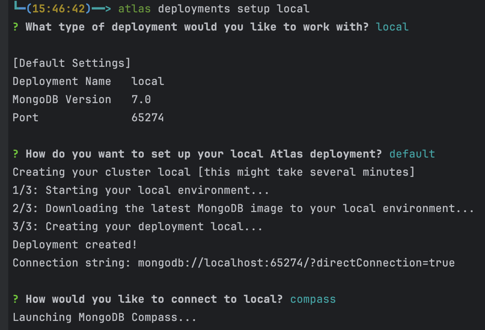
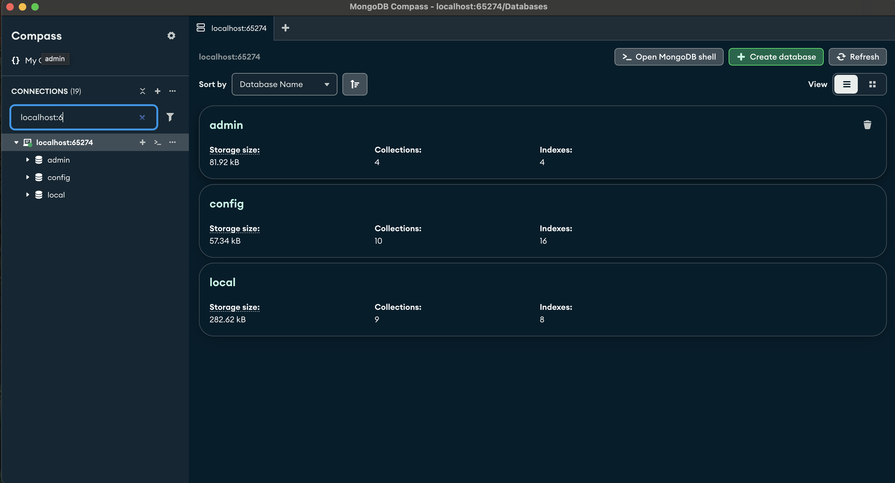

# Version Record Updates

A Spring Boot application demonstrating versioned record management with MongoDB.

## Project Overview

This application implements a system for managing member records with complete version history. Every update to a member record creates a new version while preserving the previous versions, establishing an audit trail of all changes.

### Key Features

- **Temporal Data Pattern**: Stores complete history of all member record changes
- **Active Record Flagging**: Uses `currInd` flag to mark which version is current
- **MongoDB Transactions**: Ensures atomicity when updating records
- **RESTful API**: Provides endpoints for member management operations
- **Comprehensive Error Handling**: Standardized error responses

## Technical Architecture

The application follows a standard Spring Boot architecture with:

- **Controllers**: Handle HTTP requests and responses
- **Services**: Implement business logic
- **Repositories**: Manage data access and persistence
- **Models**: Define the data structures

## Related Documentation for Features impliemented

- [Partial Indexing] (https://www.mongodb.com/docs/manual/core/index-partial/)
- [Compound Indexing] (https://www.mongodb.com/docs/manual/core/indexes/index-types/index-compound/)
- [ESR Indexing Rule] (https://www.mongodb.com/docs/manual/tutorial/equality-sort-range-rule/)
- [Transactions] (https://www.mongodb.com/docs/manual/core/transactions/)
- [Update Syntax Options (Mongo Shell)] (https://www.mongodb.com/docs/manual/reference/method/db.collection.update/)
- [Update Syntax Options (Java)] (https://www.mongodb.com/docs/drivers/java/sync/current/usage-examples/updateOne/)

### Data Model

The core `Member` entity contains:

- Member identification information (memberId, firstName, lastName, etc.)
- Version metadata (version, currInd)
- Temporal tracking (effStartDate, effEndDate)

When a member record is updated:
1. The current record is marked as inactive (`currInd="N"`)
2. A new record is created with an incremented version number (`version+1`)
3. Only the current record (`currInd="Y"`) is returned by default queries

## Getting Started

### Prerequisites

- Java 17 or higher
- MongoDB version 8
- Maven 3.6 or higher 
- MongoDB Compass --> https://www.mongodb.com/try/download/compass
- Docker and Atlas CLI (For Local MongoDB Deployment only) --> https://www.mongodb.com/docs/atlas/cli/current/install-atlas-cli/

### MongoDB Setup

#### Option 1: Local MongoDB with Atlas CLI

The Atlas CLI provides a simple way to create a local MongoDB deployment:

1. Install the Atlas CLI:
   ```
   brew install mongodb-atlas-cli
   ```

2. Create a local Atlas deployment:
   ```
   atlas deployments setup local
   ```

3. Start your local deployment:
   ```
   atlas deployments start local
   ```

4. Select the following prompts and your terminal should look like the below imaage `local` -> `defualt` -> `compass`.  Ensure you copy the `Connection string:` details to put in your springboot configurations. 

5. If installed, Compass should automatically open with the connection to your local cluster.

For detailed instructions, see the [MongoDB Atlas CLI documentation](https://www.mongodb.com/docs/atlas/cli/current/atlas-cli-deploy-local/#create-a-local-atlas-deployment-1).

#### Option 2: MongoDB Atlas (Cloud)

1. Create a free account at [MongoDB Atlas](https://www.mongodb.com/cloud/atlas/register)
2. Create a new cluster (the free tier is sufficient)
3. Set up a database user with read/write privileges
4. Configure network access (whitelist your IP address)
5. Get your connection string from the Atlas UI
6. Open Compass on your local machine and use the credentials to connect to your Atlas instance

### Setting Up Required MongoDB Indexes

Once MongoDB is up and running, you need to set up the following indexes for efficient querying using MongoDB Compass:

1. Click on the "Open MongoDB Shell" button in the top-right corner of the Compass interface to open the MongoDB Shell 
2. Run the following commands in the console:
   ```javascript
   // Switch to the memberdb database referenced in the code
   use memberdb
   
   // If the database is empty it will create the member collection
   // Create a unique compound index on memberId and currInd
   // This ensures only one active record exists per memberId
   // Only Indexes documents that have currInd = "Y" reducing the overall size of the index
   db.member.createIndex(
     {"memberId":1,"currInd":1}, 
     {
       "name":"memberId_1_currInd_1",
       "unique":true,
       "partialFilterExpression":{"currInd":"Y"}
     }
   )
   
   // Create an index on memberId for faster queries
   db.member.createIndex(
     {"memberId":1}, 
     {"name":"memberId_1"}
   )
   ```

These indexes are critical for both performance and data integrity in the application.

### Cloning the Repository and Configuring the Application

1. Clone the repository (same command for macOS or Windows):
   ```
   git clone https://github.com/yourusername/version-record-updates.git
   ```

2. Update your MongoDB connection string in the Spring Boot configuration:
   - Open src/main/resources/application.properties
   - Set the URI to your local or Atlas connection string, for example:
     ```
     spring.data.mongodb.uri=mongodb://localhost:27017/memberdb
     ```
3. Build the application:
   - **macOS/Linux**:
     ```
     ./mvnw clean package
     ```
   - **Windows (PowerShell)**:
     ```
     .\mvnw.cmd clean package
     ```
4. Start the Spring Boot service:
   - **macOS/Linux**:
     ```
     ./mvnw spring-boot:run
     ```
   - **Windows (PowerShell)**:
     ```
     .\mvnw.cmd spring-boot:run
     ```

You can now test your endpoints after the application starts successfully.

## Testing the Endpoints

You can send requests using a REST client like Postman or from the command line with curl. Below are macOS/Linux examples using jq for formatting JSON responses:

```bash
curl --location 'http://localhost:8080/members/insert' \
--header 'Content-Type: application/json' \
--data '{
    "firstName": "scott",
    "lastName": "capista",
    "primaryNumber": "4015551234",
    "memberId": "12345681"
}' | jq

curl --location 'http://localhost:8080/members/updateMemberKeepHistory' \
--header 'Content-Type: application/json' \
--data '{
    "firstName": "scott",
    "lastName": "capista",
    "primaryNumber": "4015551235",
    "memberId": "12345681"
}' | jq

curl --location 'http://localhost:8080/members/latestRecord/12345681' | jq
```

For Windows (PowerShell):

```powershell
# Insert a new member
Invoke-RestMethod -Uri "http://localhost:8080/members/insert" -Method POST `
  -Headers @{ "Content-Type" = "application/json" } `
  -Body '{"firstName":"scott","lastName":"capista","primaryNumber":"4015551234","memberId":"12345681"}'

# Update the member (create a new version)
Invoke-RestMethod -Uri "http://localhost:8080/members/updateMemberKeepHistory" -Method POST `
  -Headers @{ "Content-Type" = "application/json" } `
  -Body '{"firstName":"scott","lastName":"capista","primaryNumber":"4015551235","memberId":"12345681"}'

# Retrieve the current member record
Invoke-RestMethod -Uri "http://localhost:8080/members/latestRecord/12345681"
```
